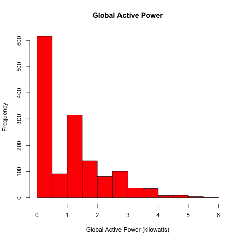
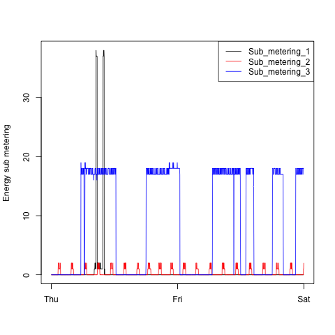
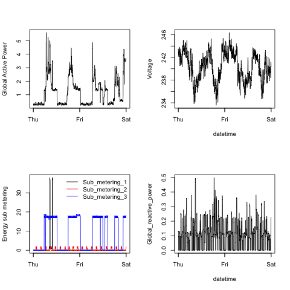

# Explorations on Household Electric Power Consumption

Delivered by [Sasmito Adibowo](http://cutecoder.org) as assignment deliverable to course ["Exploratory Data Analysis"](https://class.coursera.org/exdata-007) by Jeff Leek, PhD, Roger D. Peng, PhD, Brian Caffo, PhD. Please refer to [the original github repository](https://github.com/rdpeng/ExData_Plotting1) for more information on the assignment.

## File Locations

 - Source files (R scripts) are in `src` folder.
 - Resulting images are in `figures` folder.
 

## Running

All the R scripts expect the resulting dataset to be **two levels up** from the working directory and named as `household_power_consumption.txt`.

 1. Download the [source dataset](https://d396qusza40orc.cloudfront.net/exdata%2Fdata%2Fhousehold_power_consumption.zip) and extract it just above the root folder of this repository. 
 2. Remove files `plot1.png` through `plot4.png` from the `figures` folder.
 3. Set the `src` folder as R's current working directory.
 4. Run scripts `plot1.R` through `plot4.R`
 5. You should get back the plotted images from the `figures` folder as `plot1.png` through `plot4.png`, respectively.
 

## Results

### Plot 1

### Plot 2

### Plot 3

### Plot 4

